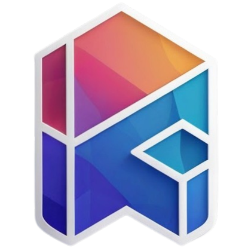

# Personal Portfolio Website



A modern, responsive personal portfolio website built with React and Vite. Showcase your skills, projects, and contact information in a clean and professional manner.

## Features

- Responsive design for all devices
- Interactive components and animations
- Project showcase section
- Contact form integration using Web3Forms
- Social media links

## Technology Stack

- React.js
- Vite
- JavaScript (ES6+)
- CSS3
- HTML5
- Web3Forms

## Environment Configuration

### 1. Create .env File

Create a `.env` file in the root directory of the project with the following content:

```env
VITE_WEB3FORMS_ACCESS_KEY=your_access_key_here
VITE_PERSONAL_EMAIL=your_email@example.com
VITE_LINKEDIN_URL=https://www.linkedin.com/in/your-profile
VITE_GITHUB_URL=https://github.com/your-username
VITE_WHATSAPP_URL=https://wa.me/yourphonenumber
```

### 2. Web3Forms Setup

1. Go to [Web3Forms](https://web3forms.com/) and sign up for an account
2. After registration, navigate to the API Keys section
3. Generate a new access key
4. Copy the access key and paste it in your `.env` file as `VITE_WEB3FORMS_ACCESS_KEY`

### 3. Personal Details Configuration

Replace the following placeholders in your `.env` file with your personal information:

- `VITE_PERSONAL_EMAIL`: Your professional email address
- `VITE_LINKEDIN_URL`: Your LinkedIn profile URL
- `VITE_GITHUB_URL`: Your GitHub profile URL
- `VITE_WHATSAPP_URL`: Your WhatsApp contact link (use format `https://wa.me/yourphonenumber`)
- `VITE_LOCATION`: Your location (City, Country)

## Project Structure

```
Personal-Portfolio/
├── public/                # Static assets
│   └── logo.png           # Project logo
├── src/                   # Source code
│   ├── assets/            # Images, icons, and data files
│   ├── Components/        # React components
│   │   ├── About/         # About section
│   │   ├── Contact/       # Contact section
│   │   ├── Footer/        # Footer component
│   │   ├── Hero/          # Hero section
│   │   ├── MyWork/        # Projects showcase
│   │   ├── Navbar/        # Navigation bar
│   │   └── Services/      # Services section
│   ├── App.jsx            # Main application component
│   ├── main.jsx           # Application entry point
│   └── index.css          # Global styles
├── .gitignore             # Git ignore file
├── package.json           # Project dependencies
├── vite.config.js         # Vite configuration
└── README.md              # Project documentation
```

## Getting Started

### Prerequisites

- Node.js (version 16 or higher)
- npm (version 7 or higher)

### Installation

1. Clone the repository:
   ```bash
   git clone https://github.com/iaman-mishra/personal-portfolio.git
   ```

2. Navigate to the project directory:
   ```bash
   cd personal-portfolio
   ```

3. Install dependencies:
   ```bash
   npm install
   ```

### Running the Project

1. Start the development server:
   ```bash
   npm run dev
   ```

2. Open your browser and visit:
   ```
   http://localhost:5173
   ```

### Building for Production

To create an optimized production build:
```bash
npm run build
```

## Contributing

Contributions are welcome! Please follow these steps:

1. Fork the project
2. Create your feature branch (`git checkout -b feature/AmazingFeature`)
3. Commit your changes (`git commit -m 'Add some AmazingFeature'`)
4. Push to the branch (`git push origin feature/AmazingFeature`)
5. Open a Pull Request
